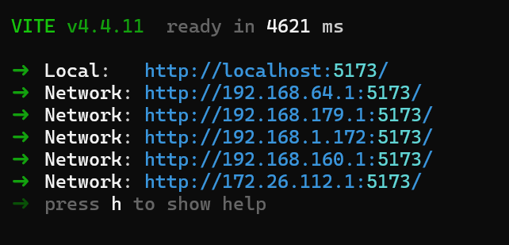
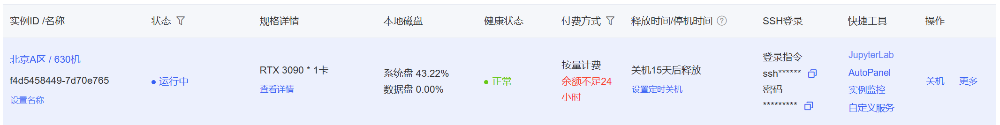
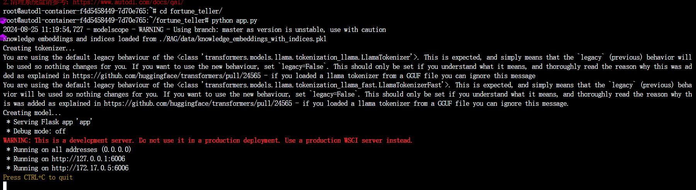
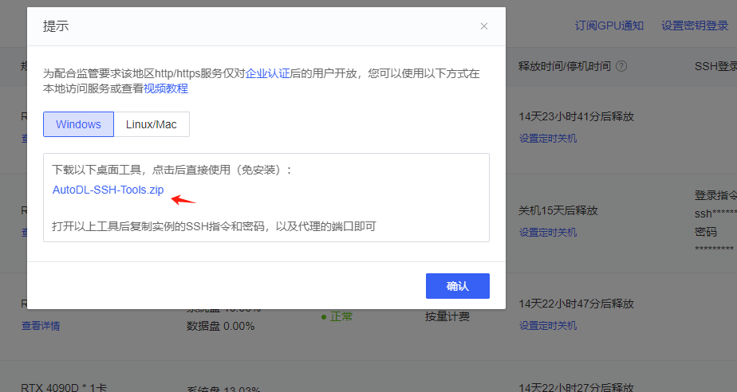
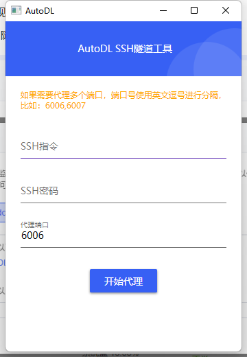
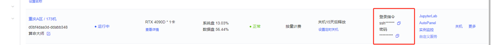
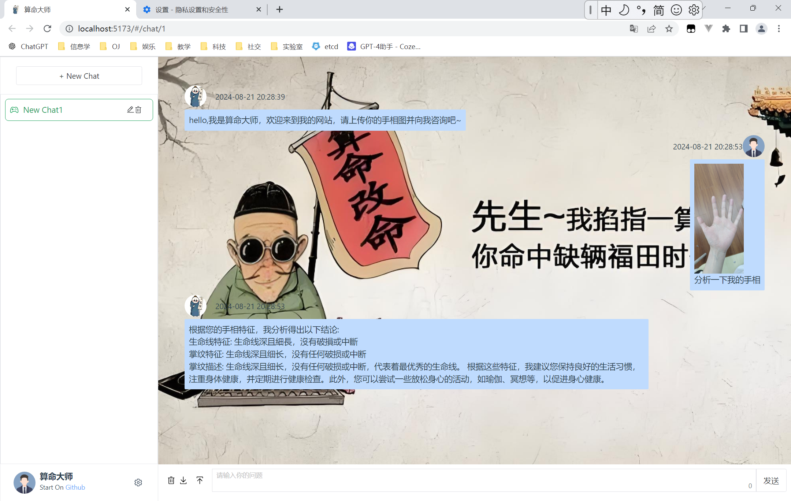
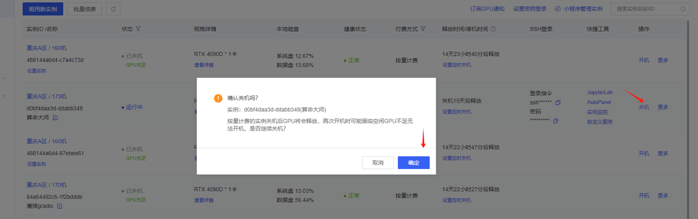

# 项目背景

手相算命，作为一种古老的预测和占卜方法，已有数千年的历史。它起源于亚洲，尤其是在中国和印度，作为传统文化的一部分，手相学被认为能够揭示个人的性格、健康、命运以及未来的趋势。尽管在现代科学的视角下，手相算命被认为缺乏严谨的科学依据，但它依然受到广泛关注和应用，尤其是在对未知的未来充满好奇的人群中。


随着大模型技术的飞速发展，基于LLM的应用在各个领域蓬勃发展。LLM具有强大的文本生成、理解和推理能力，可以从海量数据中学习并模仿人类语言的模式。利用这些技术，开发一个基于手相的算命大师的系统不仅可以数字化、现代化手相算命这一传统文化，还可以通过技术手段增强其互动性和用户体验。这个系统将综合传统手相学的知识与现代AI技术，为用户提供一种独特的娱乐体验，同时保留手相算命的神秘感和趣味性。


## 项目成员介绍

| 姓名   | 性别 | 学校                 | 学历   | 分工                 |
| ------ | ---- | -------------------- | ------ | -------------------- |
| 苏向标 | 男   | 广州大学             | 本科生 | RAG, 调试, 答辩      |
| 叶睿卿 | 男   | 哈尔滨工业大学       | 研究生 | 多模态部分和项目部署 |
| 刘嘉榕 | 女   | 福州大学             | 本科生 | 前端                 |
| 刘伟鸿 | 男   | 江南大学             | 研究生 | LLM部分              |
| 孟鑫   | 男   | 电子科技大学成都学院 | 本科生 | 后端Flask接口   |


## 算命大师安装文档


下载Nodejs， 版本信息

```
node 18.6.0 
npm 9.6.2 
vue3
```


## 1. 前端部分使用vue框架进行开发

这一部分是使用多模态的代码， 基于gpt4-o来开发的多模态和Yuan2B开发的应用，另一个版本的前端页面是取消了多模态， 采用单纯原生的Yuan2B大模型来开发的， 可以clone下面的代码拿到原生的前端代码


基于Yuan2B模型开发的页面
```shell
git clone https://github.com/gzhuuser/fortune_teller_UI.git

npm install
# 运行页面
npm run dev
```

基于gpt4-o的多模态页面可以使用下面命令进行安装

```shell
# 下载代码
git clone https://github.com/gzhuuser/fortune_teller.git
# 进入项目目录按照依赖
cd front
npm install
# 运行页面
npm run dev
```

运行界面如下所示，说明前端界面启动：


## 2. 后端部分使用flask框架进行开发

可以使用pip进行安装python
采用autoDL云计算平台，新建一个虚拟机环境， 环境为python3.12 torch为2.3.0


进去后先clone github仓库

```shell
git clone https://github.com/gzhuuser/fortune_teller.git
```

然后进行环境配置

```shell
pip install -r requirements.txt
```

运行前记得在.env_template里面填写好4.0的key和自己的阿里云oss的key, 用的时候把.env_template 复制一份出来改名成.env，将key填好

运行后端程序app.py

```shell    
python app.py
```

运行界面如下所示，说明后端程序启动：


下载ssh工具进行端口映射，将本地端口映射到云端虚拟机端口

### ssh隧道软件如下



### 打开效果图（注意这里的端口映射看看6006有没有反应，没有的话改成9000）



### 输入ssh指令和密码，就可以访问本地的http://localhost:6006/v1和v2了



多模态运行效果图片

## 运行效果图片



### 结束记得关机



