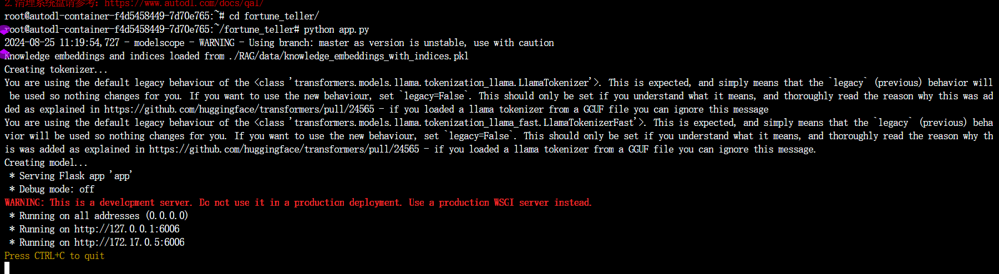

# 算命大师安装文档

## 1. 前端部分使用vue框架进行开发
可以使用npm进行安装node
```shell
# 下载代码
git clone 
# 进入项目目录按照依赖
cd front
npm install
# 运行页面
npm run dev
```
运行界面如下所示，说明前端界面启动：


## 2. 后端部分使用flask框架进行开发
可以使用pip进行安装python
采用autoDL云计算平台，新建一个虚拟机环境


进行环境配置
```shell
pip install -r requirements.txt
```
运行后端程序app.py
```shell    
python app.py
```
运行界面如下所示，说明后端程序启动：


下载ssh工具进行端口映射，将本地端口映射到云端虚拟机端口

